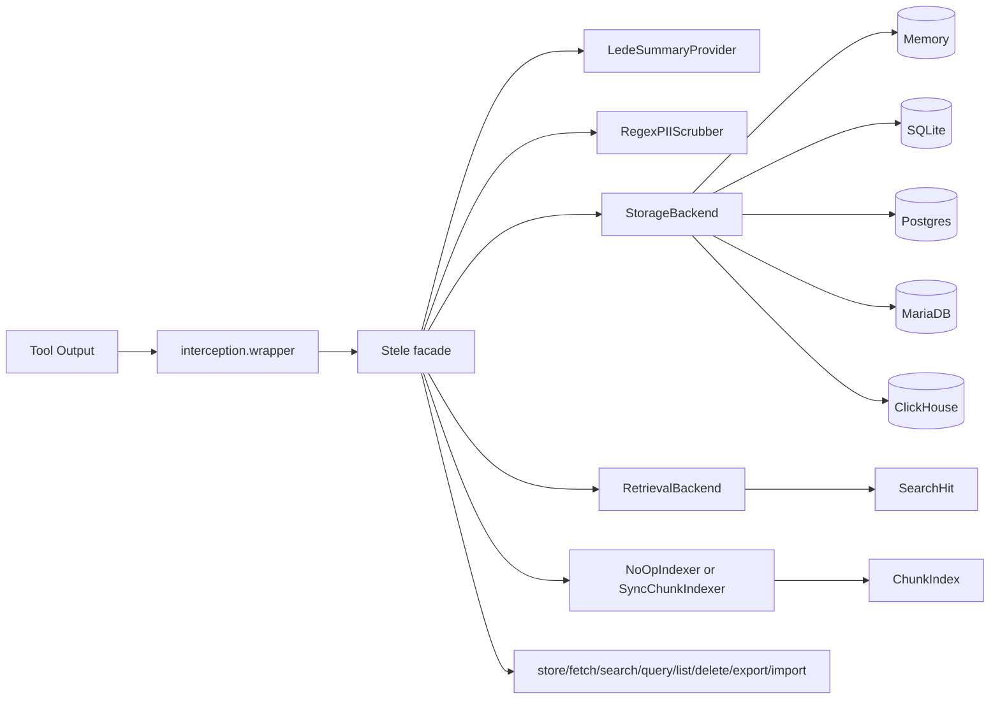
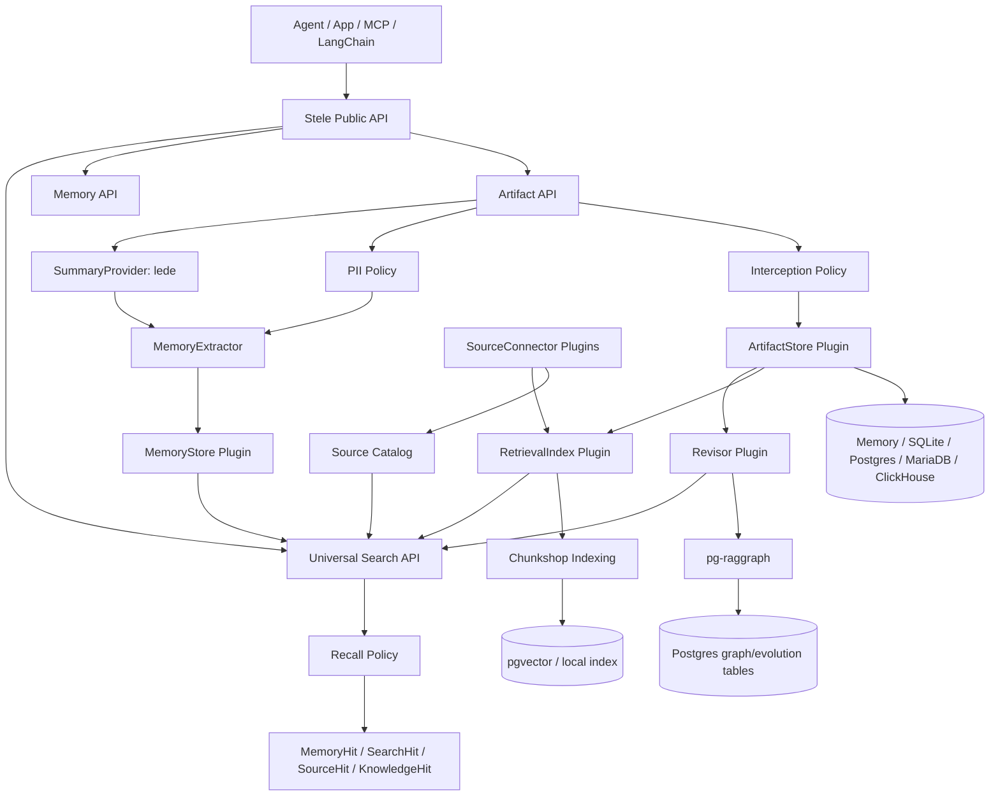
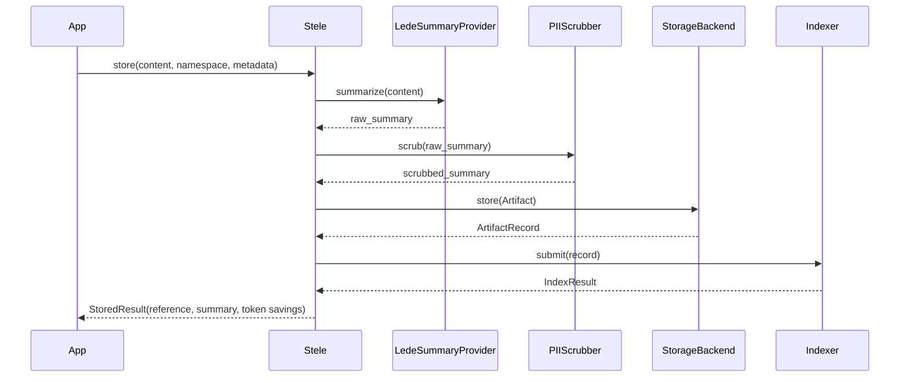
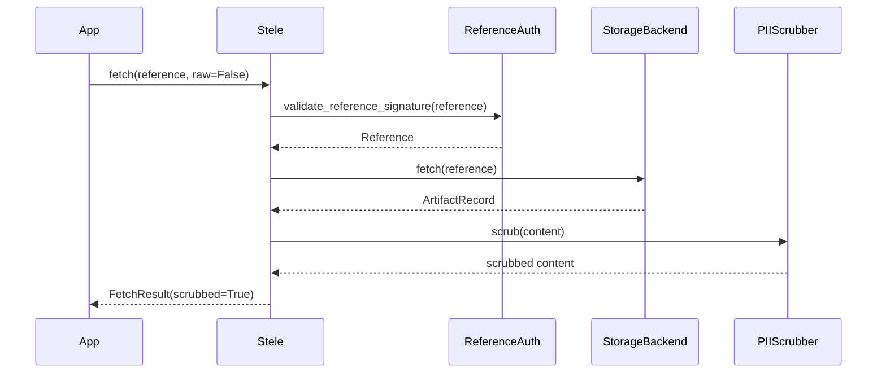
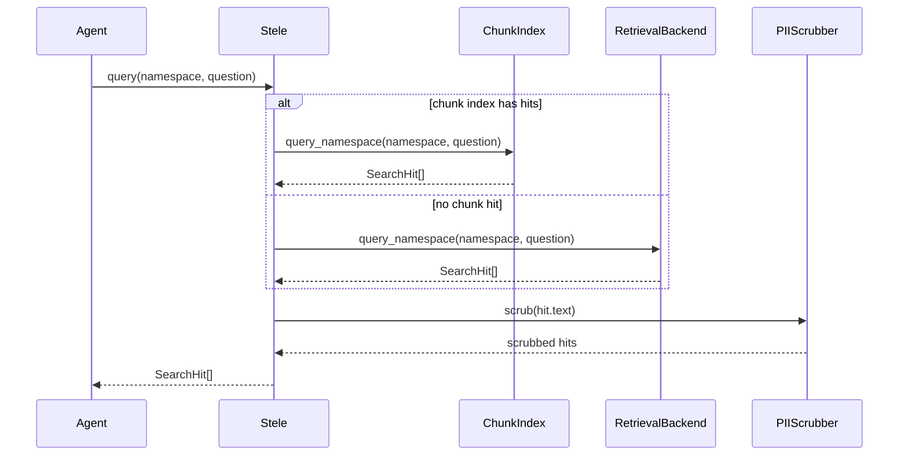
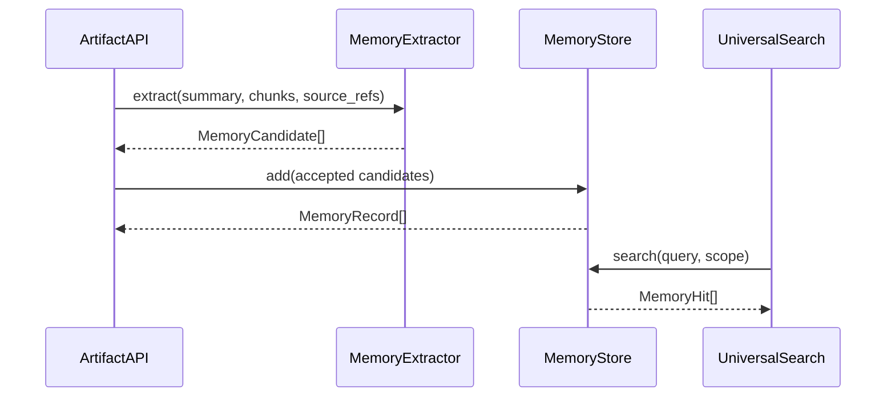
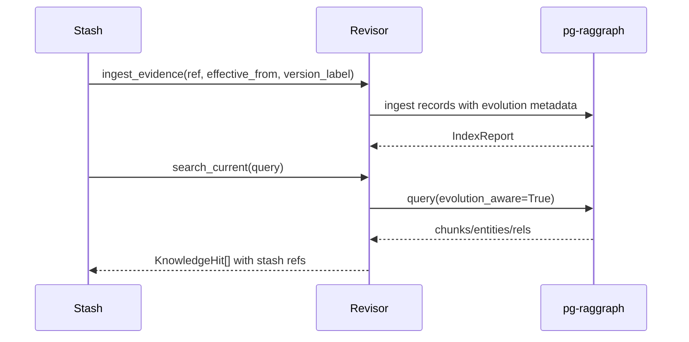
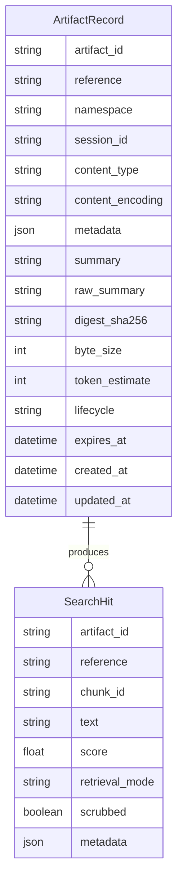
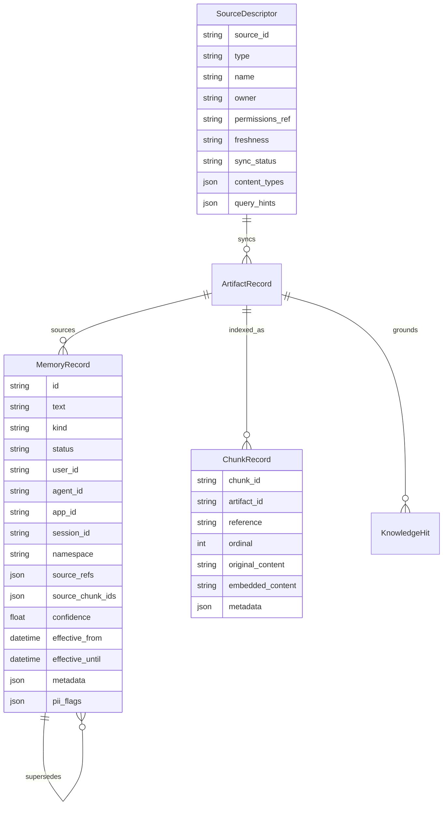
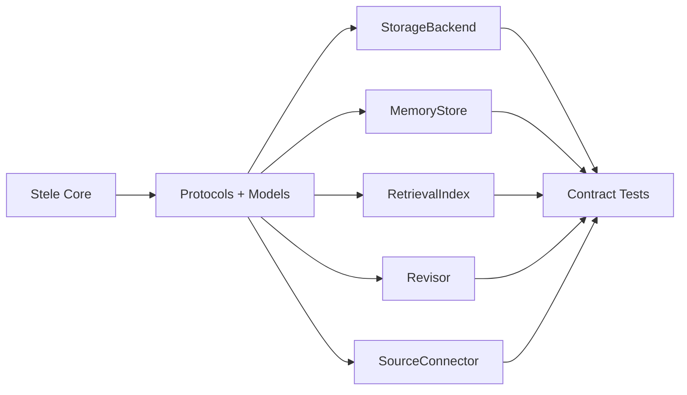

# Sovereign Stele Architecture

## TLDR

The current system is a Python library with a `Stele` facade, exact
artifact storage backends, PII-safe model-visible surfaces, keyword/chunk
retrieval, and structural tool-output interception. The target architecture
keeps that artifact layer as the root of trust and adds a modular sovereign
memory layer: local memory CRUD, deterministic extraction, source catalog,
universal search, Chunkshop indexing, optional pg-raggraph living knowledge, and
replaceable backend plugins.

## 1. System Purpose and Context

Stele exists to keep large or sensitive LLM tool outputs out of the
model prompt while preserving exact fetch and useful retrieval. It is currently
a Python 3.12+ package with optional SQL backend dependencies and benchmark
entry points.

The sovereign target expands the package from "off-prompt artifact store" into a
source-backed memory and knowledge API for agents. That expansion should not
weaken the existing guarantee: exact artifacts are stored and fetched
independently from semantic search, graph search, or memory extraction.

## 2. Current High-Level Architecture



## 3. Target Sovereign Architecture



## 4. Technology Stack

| Layer | Current Technology | Target/Optional Technology | Rationale |
| --- | --- | --- | --- |
| Language | Python 3.12+ | same | typed library surface, simple agent integration |
| Models | Pydantic v2 | same | stable public result/config models |
| Config | YAML/dict/path via `StashConfig` | profiles and plugin configs | supports local files and embedding in apps |
| Summary | `lede` | local LLM optional | deterministic default, local-first |
| PII | regex scrubber | local Presidio/spaCy optional | sovereign default without external calls |
| Storage | memory, SQLite, Postgres, MariaDB, ClickHouse | plugin backends | exact artifact portability |
| Retrieval | keyword/FTS/backends, ChunkIndex fallback | Chunkshop, pgvector, universal search | search-first benchmark path |
| Graph | none in current package | pg-raggraph adapter | living knowledge, supersession, time/version |
| Benchmarks | Python modules/scripts | external adapters | evidence for public claims |

## 5. Module Breakdown

### `core`

Key files:

- `core/stash.py`
- `core/artifact.py`
- `core/config.py`
- `core/reference.py`
- `core/reference_auth.py`
- `core/jsonl.py`

Responsibilities:

- public `Stele` facade
- artifact/result models
- config loading
- `stele://` references and signing validation
- JSONL export/import
- orchestration across summary, PII, storage, retrieval, and indexing

### `storage`

Key files:

- `storage/base.py`
- `storage/memory.py`
- `storage/sqlite.py`
- `storage/postgres.py`
- `storage/mariadb.py`
- `storage/clickhouse.py`

Responsibilities:

- exact artifact persistence
- list/fetch/delete/cleanup
- backend capability reporting
- backend-native schema and delete semantics

### `retrieval`

Key files:

- `retrieval/base.py`
- `retrieval/memory.py`
- `retrieval/sqlite.py`
- `retrieval/postgres.py`
- `retrieval/mariadb.py`
- `retrieval/clickhouse.py`
- `retrieval/rank.py`

Responsibilities:

- reference-scoped search
- namespace-scoped query
- keyword/FTS/backend-native search
- package-owned `SearchHit` output

### `indexing`

Key files:

- `indexing/chunk_index.py`
- `indexing/queue.py`
- `indexing/job.py`

Responsibilities:

- optional chunk indexing path
- deterministic fixed-overlap fallback
- Chunkshop chunker use when installed
- current process-local chunk search

Target responsibility:

- production `RetrievalIndex` adapter for Chunkshop vector sinks.

### `interception`

Key files:

- `interception/wrapper.py`
- `interception/detector.py`
- `interception/thresholds.py`
- `interception/response.py`

Responsibilities:

- serialize tool results
- decide whether to intercept
- store oversized result
- return compact replacement payload

Target responsibility:

- LangChain middleware and MCP tool behavior using the same policy path.

### `pii`

Key files:

- `pii/regex.py`
- `pii/scrubber.py`
- `pii/base.py`

Responsibilities:

- local deterministic PII detection and replacement
- scrub summaries, fetch output, and search hits
- enforce raw output gate through the facade

### `summary`

Key files:

- `summary/lede_adapter.py`
- `summary/base.py`

Responsibilities:

- deterministic summary generation through `lede`
- summary provider protocol boundary

## 6. Critical Data Flows

### 6.1 Store Artifact



### 6.2 Safe Fetch



### 6.3 Search First Recall



### 6.4 Target Memory Extraction



### 6.5 Target Living Knowledge



## 7. Data Model

### Current Core Models



### Target Memory and Knowledge Models



## 8. Public API Surface

### Current API

```python
stash = Stele.from_config(config)
stored = stash.store(content, namespace="default", metadata={})
fetched = stash.fetch(stored.reference)
hits = stash.search(stored.reference, "query")
hits = stash.query("default", "query")
page = stash.list(namespace="default")
deleted = stash.delete(stored.reference)
stash.cleanup_expired()
stash.export_jsonl(path)
stash.import_jsonl(path)
stash.capabilities()
stash.close()
```

### Target Memory API

```python
memory.add(messages=[...], user_id="u1", source_refs=[stored.reference])
memory.search("what did we decide?", user_id="u1")
memory.list(user_id="u1")
memory.get(memory_id)
memory.update(memory_id, text="...")
memory.delete(memory_id)
```

### Target Universal Search API

```python
stash.search_knowledge(
    query="what do we know about Acme SSO issues?",
    scope={"customer": "acme"},
    privacy_mode="scrub",
    evidence_required=True,
)
```

## 9. Configuration

Current config model:

| Section | Purpose |
| --- | --- |
| `backend` | selects memory, SQLite, Postgres, MariaDB, or ClickHouse |
| `summary` | summary provider and max chars |
| `pii` | scrub policy, raw fetch gate, providers |
| `interception` | thresholds and fail mode |
| `retrieval` | default retrieval mode |
| `indexing` | chunk indexing provider/mode/chunk sizing |
| `signing` | reference signature mode and TTL |

Target config additions:

| Section | Purpose |
| --- | --- |
| `profile` | `sovereign-lite`, `sovereign-search`, `sovereign-graph`, `sovereign-enterprise`, `adapter-mode` |
| `memory` | MemoryStore config, extraction policy, duplicate/supersession policy |
| `universal_search` | routing, scoring, abstention, evidence requirements |
| `living_knowledge` | pg-raggraph adapter, retraction/supersession policy |
| `connectors` | source catalog and sync configuration |
| `plugins` | entry points, capability checks, contract-test mode |

## 10. Plugin Architecture



Every plugin must report capabilities:

```text
exact_fetch
keyword_search
vector_search
graph_search
living_knowledge
delete_semantics
pii_enforcement
sovereign
network_required
```

The policy engine routes based on capability, not on implementation name.

## 11. Cross-Cutting Concerns

### Privacy

PII scrubbing currently applies to summaries, default fetch output, and search
results. Raw fetch requires `pii.raw_fetch_enabled=true`.

Target memory behavior must apply the same policy to memory text, memory hits,
source descriptors, universal search output, and graph/living-knowledge hits.

### Sovereignty

Default profiles must not require hosted APIs. Optional external adapters must
declare `network_required=true` or `sovereign=false`.

### Evidence and Provenance

Every memory, chunk, graph hit, and source hit should carry source refs. Source
refs should resolve to exact artifacts or source descriptors.

### Deletion and Retention

Storage backends have different delete semantics. ClickHouse may be mutation
based; memory/SQLite/Postgres/MariaDB are immediate in the current docs. Plugin
capabilities must surface these differences.

### Error Handling

Current package-specific exceptions include config, backend, artifact not found,
capability, reference, signature, PII block, optional dependency, and indexing
errors. Target plugin errors should preserve these package-owned categories.

## 12. Deployment Patterns

### Local Development

```text
Python app
  -> Stele
  -> memory backend or SQLite
  -> lede + regex PII
```

Use for tests, demos, and single-user local agents.

### Sovereign Search

```text
Agent app
  -> Stele
  -> SQLite/Postgres exact store
  -> Chunkshop local embeddings
  -> universal search
```

Use when keyword search is not enough but graph/living knowledge is not needed.

### Sovereign Graph

```text
Agent app
  -> Stele
  -> Postgres exact store
  -> Chunkshop pgvector
  -> pg-raggraph living knowledge
  -> local LLM endpoint optional
```

Use when knowledge changes over time, facts supersede old facts, or graph
relationships matter.

### Sovereign Enterprise

```text
Source connectors
  -> Source catalog
  -> Artifact store
  -> Chunkshop bakeoff/indexing
  -> pg-raggraph optional
  -> Universal search
  -> Agent apps
```

Use when agents need both runtime memory and preemptively indexed enterprise
knowledge.

## 13. Known Limitations

Current limitations:

- no Mem0-like memory CRUD layer yet
- no universal search facade yet
- no source connector catalog yet
- no pg-raggraph adapter yet
- no complete LangChain/MCP integration
- no external benchmark adapters or competitor baselines yet
- Chunkshop path currently uses a process-local `ChunkIndex` with fixed-overlap
  behavior/fallback, not a full vector sink integration

Architecture risks:

- memory and artifact concepts may blur unless source refs remain mandatory
- universal search could become too broad and deserve a separate product later
- backend plugin system can overgrow before first-party protocols stabilize
- living-knowledge claims require Stele-owned verification, not only
  pg-raggraph sibling benchmarks

## 14. Architecture Decisions

### ADR-001: Exact Artifact Store Is the Root of Trust

**Status:** Accepted  
**Date:** 2026-05-12  
**Decision:** Store raw artifacts exactly and keep fetch independent from search,
memory extraction, and graph retrieval.  
**Rationale:** Retrieval can be approximate, but source evidence must be exact
for audit, debugging, privacy review, and benchmark truth.  
**Consequence:** Every higher layer must carry source refs.

### ADR-002: Sovereign Defaults, External Adapters Optional

**Status:** Accepted  
**Date:** 2026-05-12  
**Decision:** Core profiles must run locally without hosted memory/search APIs.  
**Rationale:** The project goal is sovereign memory infrastructure.  
**Consequence:** External tools such as Mem0, Zep, Letta, MemPalace, Pinecone, or
other services can be adapters, but not core dependencies.

### ADR-003: Universal Search Starts Inside the Product

**Status:** Accepted  
**Date:** 2026-05-12  
**Decision:** Build `search_knowledge` as an internal facade over memories,
artifacts, chunks, graph hits, and source descriptors.  
**Rationale:** Agents should not need to choose among five recall tools.  
**Consequence:** Split into a separate product only if it gains independent
gravity.

### ADR-004: pg-raggraph Is the Living Knowledge Adapter

**Status:** Accepted  
**Date:** 2026-05-12  
**Decision:** Use pg-raggraph for Postgres-specific evolving knowledge when
enabled.  
**Rationale:** It already models effective dates, versions, retractions, and
supersession.  
**Consequence:** Stele must wrap it behind package-owned models and verify
behavior through adapter tests.

### ADR-005: Chunkshop Is the Indexing Pipeline

**Status:** Accepted  
**Date:** 2026-05-12  
**Decision:** Use Chunkshop for local chunking, embedding, metadata extraction,
and bakeoff-driven retrieval recipes.  
**Rationale:** It solves corpus-specific ingest better than a hard-coded
chunker.  
**Consequence:** Current process-local chunking should evolve into a production
RetrievalIndex adapter.

## 15. Verification Plan

Architecture completion requires:

- storage and retrieval contract tests for all first-party backends
- memory CRUD contract tests
- universal search contract tests
- plugin capability/contract tests
- pg-raggraph living-knowledge adapter tests
- source connector tests for local files, JSONL, and SQL
- external benchmark adapters for LongMemEval and at least one RAG benchmark
- PII leakage fixtures across artifacts, memories, search, source descriptors,
  and graph hits
- offline/no-network verification after setup

## 16. Related Documents

- [Current Status](../project/current-status.md)
- [Sovereign Memory System Plan](../archive/sovereign-memory-system-plan.md)
- [Pinecone Nexus Assessment](../archive/pinecone-nexus-assessment.md)
- [Industry Benchmark Plan](../archive/industry-benchmark-plan.md)
- [Backend Matrix](../reference/backend-matrix.md)
- [Product API Spec](../specs/product-api-spec.md)
